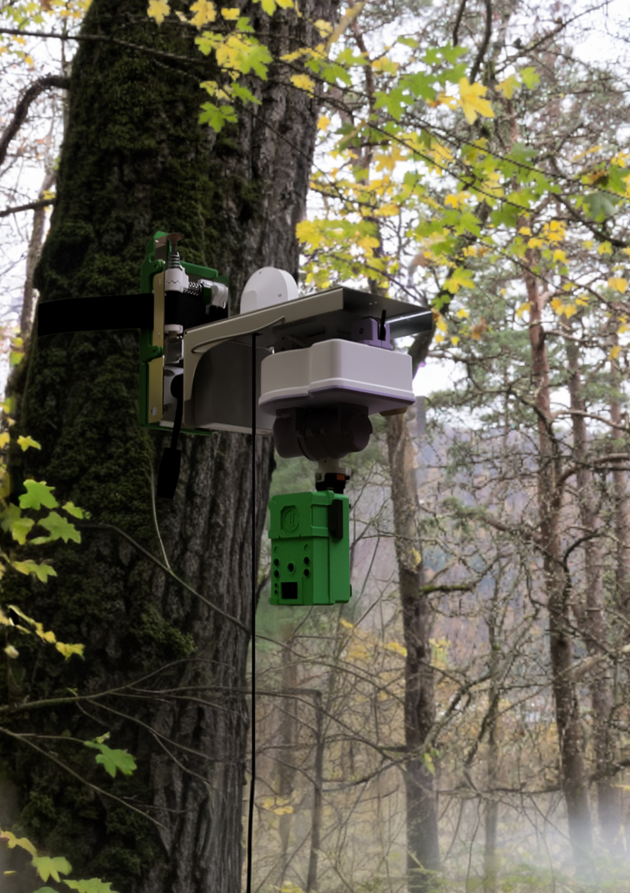

# 🌳 EcoRig
### *Treetop Views Without Climbing*

> **Making wildlife conservation safer with ground-based arboreal camera servicing**

EcoRig is a ground-serviceable rigging system for arboreal camera traps that eliminates the need for repeated tree climbing. After a single installation, all maintenance — battery replacement, SD card retrieval, and camera angle adjustment — is performed entirely from the ground. Field-tested with the **National Parks Board Singapore (NParks)** at the Singapore Botanic Gardens, surviving two thunderstorms at 15m height.

Built as a Term 5 EPD - Engineering Design Innovation (30.007) Project at **Singapore University of Technology and Design (SUTD)**, Group 16.

**Impact: 93.75% reduction in tree climbs** — from 8 per year to once every two years per camera trap.



[](https://www.youtube.com/watch?v=12M0SeIs280)
Watch this video by click on it ^

---

## 📖 Background

Arboreal camera traps are essential for monitoring endangered canopy species. But maintaining them is hazardous and expensive:


- Trained arborists must **climb up to 40m** carrying **loads up to 15kg**, just to retrieve an SD card or replace batteries
- Certification costs exceed **$2,000**, and firms like Camphora Pte. Ltd. spend **$800** to service just five traps
- Maintenance is required every **1–6 months**, and delayed servicing causes camera downtime and data loss
- Existing partial solutions (e.g., CanopyCam) still require climbing for angle adjustment and strap loosening

EcoRig addresses all of these — with a rope-based rigging system selected via Pugh chart analysis over legged climbers, grippers, aerial platforms, and human SRT.

---

## ✨ System Features

### 🔗 Adaptive Release Strap
- Anchors the EcoRig permanently to the tree trunk
- **Ratcheting mechanism** allows slow quasi-static expansion as the tree grows (averaging around 12cm over 2 years), while resisting impulsive animal tugs via a bucktooth jam brake
- TPU-covered strap face for friction against bark (µ = 0.6)
- Strap tension designed within the window: `Tm < T < Tg` (384N–2500N), keeping T = 400N
- Tripod head integrated into buckle — pitch: −35° to +75°, roll: ±360°, yaw: +90°

### 🎥 3-Pulley Camera Retrieval System
- Camera module is raised and lowered from the **ground** via a 3-pulley paracord system
- **Magnetic docking** latches the camera module securely at the top mount
- **Pneumatic tube release** actuated from the ground decouples the latch and lowers the camera
- Docking tolerates ±15° pitch and ±3° roll misalignment
- Validated: 0 derailments over 50 cycles; no sheath damage after 100 cycles + 8 days sun/rain

### 🎯 Motorised Pan–Tilt System
- **Worm gear (1:160)** drives the pan–tilt mechanism — non-backdrivable, preventing wildlife tampering
- Planetary gearset (1:171.5) developed and evaluated as alternative (worm gear chosen for field robustness)
- Pan: ±90°, Tilt: ±38°
- **Repeatability: ±0.7°** over 10 repeats to the same setpoint
- Holds **0.42 kg·m (~4.1 N·m)** without slip under tamper load

### 📡 ESP32-S3 Control & Web Interface
- **Wi-Fi SoftAP mode** — creates a local access point; any smartphone connects without additional hardware
- HTTP server hosted directly on ESP32-S3; live video streamed over same network
- Pan–tilt control via web app with real-time OV2640 5MP camera feed
- WiFi range: 46m LOS / 27m under canopy; command latency ≈ 210ms
- **BMI160 6-axis IMU** (gyro + accelerometer) replaces encoders for proprioception
- Kalman filter fuses gyro/accelerometer data for noise-robust angle estimation
- Finite State Machine (FSM) supervises the calibration algorithm

### 🧠 Intelligent Auto-Calibration
Self-discovers pan–tilt mechanical limits without encoders or limit switches:
1. **Stall detection** — motors sweep until BMI160 gyro angular velocity drops below 3°/s, indicating a mechanical hard stop
2. **Back-off & re-test** — system reverses 350 ms, then re-advances to confirm the exact limit position
3. **Map usable range** — discovered limits saved to flash (NVS via `Preferences`); asymmetry auto-compensated (e.g., tilt +28°/−22° → center adjusted); limits reload on next boot

### 🌧️ Weatherproof Housing
- **Labyrinth seal** — forces fluids and insects through a tortuous path before reaching electronics; no degradable gaskets
- Validated IP35 (spray nozzle test, no ingress)
- Electronics survived two thunderstorms during NParks field test

---

## 🔧 Electronics & Hardware

| Component | Specification |
|---|---|
| Microcontroller | ESP32-S3 |
| Camera | OV2640 5MP |
| IMU | BMI160 (3-axis gyro + 3-axis accelerometer) |
| Display | SSD1306 OLED (local diagnostics) |
| I²C Mux | TCA9545A (resolves address conflicts between OLED and IMU) |
| Motor Driver | L293DD H-bridge |
| Motors | RS370 DC motors (pan & tilt) |
| Battery | 12V 3000mAh LiPo |
| Power Regulation | DC–DC step-down converter → 5V for ESP32 |
| Peak current draw | ≤3.5A @ 12V (validated in field) |
| Battery life achieved | 21 days (target: 120 days) |
| PCB | Custom — consolidates motor drivers, power distribution, signal routing |

---

## 📐 Mechanical Design & Modelling

### Gear Tooth Bending Stress (Lewis Equation)
Planetary gearset validated for monkey-tamper resistance:

| Load | Bending Stress | Status |
|---|---|---|
| 3.65 kg | ≈ 3.65 MPa | ✅ Safe |
| 5.17 kg | ≈ 5.17 MPa | ✅ Safe |
| 7.94 kg | ≈ 7.94 MPa | ⚠️ Near 8 MPa allowable (ASA FDM) |

Gear geometry: 15 teeth, module 1.03mm, face width 7.5mm, 20° full-depth spur, Lewis factor Y = 0.28.

### Adaptive Strap Tension Bounds
- Upper limit (tree growth): `Tg = Pg · r · w` → **2500 N**
- Lower limit (monkey + system weight): `Tm = (Ms + M)g / (2µ sin b)` → **384 N**
- Design tension: **T = 400 N**
- Spring constants derived: ks = 4.3 N/mm, kc = 9.3 N/mm

---

## 📊 Validated Performance

| Requirement | Target | Result |
|---|---|---|
| Servicing time | < 20 min | **11:56** ✅ |
| Installation/retrieval | < 30 min | **12:31 / 8:24** ✅ |
| Carry-in weight | < 15 kg | **≤ 4.5 kg** ✅ |
| Pan–tilt repeatability | < 1° | **±0.7°** ✅ |
| Non-backdrive hold | > 0.35 kg·m | **0.42 kg·m** ✅ |
| WiFi latency | < 250 ms | **210 ms** ✅ |
| WiFi range (canopy) | > 30 m | **27 m** |
| Strap expansion | +17mm @ 260N | **1.5mm @ 520N** ✅ |
| Tug resistance | 8 kg @ 5 m/s | **No undock** ✅ |
| Static sag | < 1° after 30 days | **0.8° after 8 days** ✅ |

---

## 🌿 NParks Field Test — 5 August 2025

- Installed at **15m height** on a *Hopea odorata* tree at Singapore Botanic Gardens
- Left in situ for **6 days** (retrieved 11 August 2025)
- Survived **two thunderstorms** with no electronics ingress
- NParks researchers verbally assessed the system as *"convenient, safe, feasible, and potentially effective"*


---

## 🔄 Modular Assembly

4-part assembly, each group < 1.6 kg. No tools required — magnetic latches throughout. Full install or retrieval in **~15 minutes**.

```
Assembly groups:
├── Bag 1: Strap + tripod head mount
├── Bag 2: Camera module (housing + pan-tilt + electronics)
├── Rigging: Paracord + pulley system
└── Control: Smartphone via WiFi
```

---

## ⚠️ Known Limitations & Next Steps

- **Battery life (21 days vs 120-day target)** — root cause: continuous H-bridge leakage current. Fix: radio duty-cycling, deep sleep scheduling, hardware power-gating
- **Corrosion** — stainless steel hardware to replace mild steel
- **Docking force** — magnet upgrade needed (9.3 kg achieved vs 15 kg target)
- **Macaque "freak" tampering** — chewing through straps/cords not yet addressed
- **Long-term deployment** — 2-year full cycle not yet experimentally validated

---

## 🏆 Award

EcoRig won **Best Product Demonstration** at the SUTD Term 5 Final Project Exhibition.


---

## 👥 Team — Group 16

Christopher Tiong · Gavin Tan · Kwan Jun Jie · Loh Kun Hong · Looi Jun Cheng · Tan Min · Samuel Teoh · Su Keming


*Special thanks to Poh Yee, Wan Ting, Marcus and Primeman from NParks Singapore.*

---

## 🏫 Course Info

**Course:** Engineering Design Innovation (30.007) — Term 5
**Institution:** Singapore University of Technology and Design (SUTD)
**Industry Partner:** National Parks Board Singapore (NParks)
**Cohort:** 2027